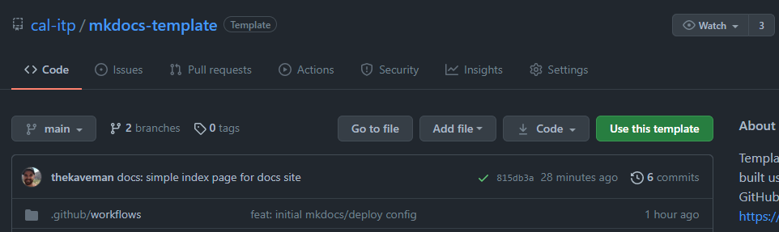
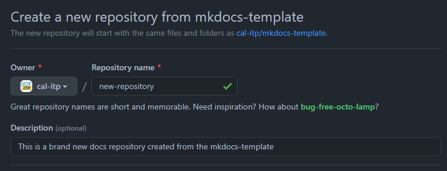

# Getting started

This repository serves as a [GitHub template repository][gh-template-repo] for Cal-ITP.

## Usage

Follow these steps to create a new repository that uses this repository as a template. Adapted from
[GitHub's documentation][gh-template-repo-howto].

1. On GitHub, navigate to the main page of this template repository:  
[`https://github.com/cal-itp/mkdocs-template`](https://github.com/cal-itp/mkdocs-template)

1. Above the file list, click **Use this template**

1. Configure the new repository's details, including the **Owner** (`cal-itp`), **Name**, and **Description**

1. Ensure the new repository's visiblity is set to **Public**

1. Ensure the checkbox to **Include all branches** is checked

1. Click **Create repository from template** to finish and create the new repository

1. _IMPORTANT:_ review the `LICENSE` file and ensure it is appropriate for your new project. If not, update it with a more
appropriate license before continuing.

1. Once the new repository is ready, it's a good idea to Find+Replace instances of `mkdocs-template` within the content
with the name of your new repository. This ensures instructions like [Running locally](./running-locally.md) continue to work
in the new project and content like the website name and URL are updated accordingly.

## How does this work?

### `mkdocs`

[`mkdocs`][mkdocs] turns markdown content inside the `docs/` directory into HTML+CSS+JS needed for a website.

The [`mkdocs.yml`](https://github.com/cal-itp/mkdocs-template/blob/main/mkdocs.yml) file in the root of the repository
configures website settings and available plugins for this build process.

The [`docs/requirements.txt`](https://github.com/cal-itp/mkdocs-template/blob/main/docs/requirements.txt) file lists the
python dependencies necessary to build the documentation using `mkdocs`.

### GitHub Actions

A [GitHub Action][gh-actions] called [`mhausenblas/mkdocs-deploy-gh-pages`][mkdocs-deploy-gh-pages] enables automated
building of new documentation content using `mkdocs`, whenever the content changes. Our workflow is defined in the
[`.github/workflows/mkdocs.yml`](https://github.com/cal-itp/mkdocs-template/blob/main/.github/workflows/mkdocs.yml) file.

The action uses the `docs/requirements.txt` file to install the necessary dependencies for building the docs site.

After running `mkdocs`, the action redeploys the documentation site by force-pushing to the `gh-pages` branch.

### GitHub Pages

[GitHub Pages][gh-pages] serves the website from the `gh-pages` branch of this repository.

Cal-ITP has an Organization site repository at <https://github.com/cal-itp/cal-itp.github.io>. This repository contains the
root website and is served (via a [`CNAME`](https://github.com/cal-itp/cal-itp.github.io/blob/main/CNAME)) from
<https://docs.calitp.org>.

GitHub Pages for Organizations functions such that any repository created in the [Cal-ITP Organization][cal-itp-org], with
GitHub Pages enabled, will have an automatic domain at `https://docs.calitp.org/repository-name`.

[cal-itp-org]: https://github.com/cal-itp
[gh-actions]: https://github.com/features/actions
[gh-pages]: https://pages.github.com/
[gh-template-repo]: https://docs.github.com/en/github/creating-cloning-and-archiving-repositories/creating-a-repository-on-github/creating-a-repository-from-a-template
[gh-template-repo-howto]: https://docs.github.com/en/github/creating-cloning-and-archiving-repositories/creating-a-repository-on-github/creating-a-repository-from-a-template#creating-a-repository-from-a-template
[mkdocs]: https://www.mkdocs.org/
[mkdocs-deploy-gh-pages]: https://github.com/mhausenblas/mkdocs-deploy-gh-pages
