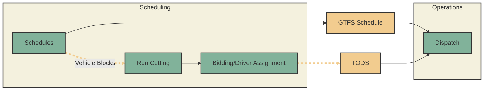

# Transit Operational Data Standard

The Transit Operational Data Standard (TODS) is an open standard for describing how to operate scheduled transit operations which can be used to port scheduled operations between software products (e.g. scheduling systems and CAD/AVL systems), agencies, and more. TODS leverages the existing General Transit Feed Specification (GTFS) and extends it to include information about personnel and non-revenue service.

View the [full TODS specification](./spec/index.md).

## Motivation

Transit providers need the systems they use to schedule and operate their service to be [interoperable](https://www.interoperablemobility.org/) so that they have the flexibility to use various software products and exchange information with other transit operators. Interoperability is best achieved through open standards. The [GTFS](https://gtfs.org) open standard successfully transmits information useful to transit riders, but is missing key concepts that are necessary for transit providers to operate the service. TODS fills this gap.

TODS is an open standard which extends GTFS to define additional operational details necessary to operate the service such as deadheads and runs.  

!!! warning "Does TODS Data have to be Open data?"

    While GTFS data can and should be public so that riders can learn about service, TODS data is typically not published in order to preserve the privacy of internal operations data.

    While the TODS standard itself is an "open standard", this doesn't necessitate the data described in TODS to be open.

## Who uses TODS?

TODS is used by transit agencies and the software which supports them including:

:material-check-circle: [WETA](https://weta.sanfranciscobayferry.com/)

:material-check-circle: [Swiftly](https://www.goswift.ly/)

:material-check-circle: [Equans Navineo](https://navineo.co/about-navineo/)

:material-check-circle: [The Master Scheduler](https://themasterscheduler.com/)

:material-check-circle: [Remix by Via](https://www.remix.com/)

:material-check-circle-outline: [Giro Hastus](https://www.giro.com/) (on request)

:material-check-circle-outline: [MBTA](http://mbta.com) (in process)

## How do I implement TODS?

If you are transit agency:

1. Talk to your current Scheduling and CAD/AVL vendors or
2. Include a requirement to use TODS in your next procurement.  The Mobility Data Interoperability Principles has sample text for adding TODS and other key interoperability features as RFP requirements in their [Interoperable Procurement Resource](https://www.interoperablemobility.org/procurement/).

If you are vendor:

1. Review the [specification](./spec/index.md) and
2. Create an development roadmap to adopting it.

Most vendors already read and write to GTFS, so this should be a marginal lift to implement.

## Citation

If you use the Transit Operational Data Standard in a report or article, please cite it as follows:

> Transit Operational Data Standard Working Group. 2022. Transit Operational Data Standard. Transit Operational Data Standard Board of Directors. https://ods.calitp.org.
