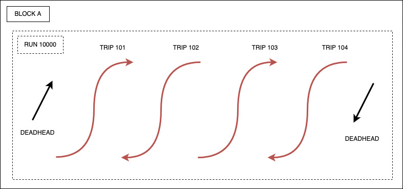

# Single Run with Single Piece

In this example, bus driver X is assigned to run 10000 and completes trips 101, 102, 103, and 104 daily.
The trips serve route 12 and are part of block BLOCK-A. Driver X begins their day at a bus yard prior to trip 101 and returns
to the same bus yard following trip 104.



## Characteristics

* Run 10000 is not subdivided into multiple pieces.
* Run 10000 and block BLOCK-A consist of the same deadheads and trips.
* The trip composition of run 10000 is the same each day of the week.

## Data

### `trips.txt`

```csv
route_id,service_id,trip_id,trip_headsign,trip_short_name,direction_id,block_id,shape_id,wheelchair_accessible,bikes_allowed
12,daily,101,,,0,BLOCK-A,,,,
12,daily,102,,,1,BLOCK-A,,,,
12,daily,103,,,0,BLOCK-A,,,,
12,daily,104,,,1,BLOCK-A,,,,
```

### `calendar.txt`

```csv
service_id,monday,tuesday,wednesday,thursday,friday,saturday,sunday,start_date,end_date
daily,1,1,1,1,1,1,1,01012022,12312022
```

### `deadheads.txt`

```csv
deadhead_id,service_id,block_id,shape_id,to_trip_id,from_trip_id,to_deadhead_id,from_deadhead_id
daily-deadhead-1,daily,BLOCK-A,,101,,,
daily-deadhead-2,daily,BLOCK-A,,,104,,
```

### `runs_pieces.txt`

```csv
run_id,piece_id,start_type,start_trip_id,start_trip_position,end_type,end_trip_id,end_trip_position
10000,10000-1,0,daily-deadhead-1,,0,daily-deadhead-2,
```
